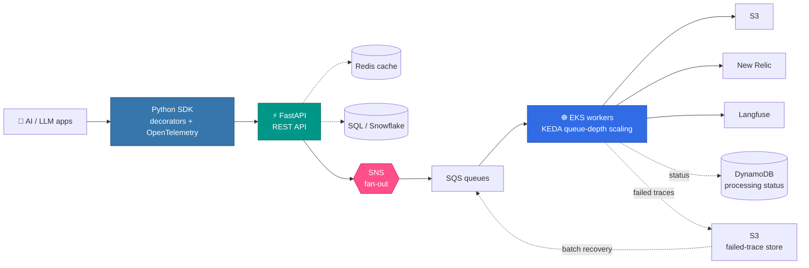
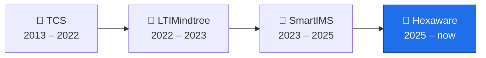

<h1 align="center">Hi 👋, I'm Suman Pathak</h1>

<h3 align="center">Technical Architect | Senior Python Backend Engineer | GenAI & LLMOps</h3>

<p align="center">
  
</p>

<p align="center">
  
  
  
  
</p>

---

## 👨‍💻 `whoami`

<p align="center">
  
</p>

<p align="center">
  
  
  
</p>

### 🛠️ What I love building

- 🐍 Production-grade **Python & FastAPI** backends
- 🧠 **GenAI / LLMOps** platforms and developer tooling
- ☁️ Cloud-native architectures on **AWS**
- 🔭 **OpenTelemetry**-based observability
- ⚡ Event-driven and asynchronous systems
- 🗄️ High-volume **SQL and data platforms**
- 🔐 Secure REST APIs and authentication workflows
- 🧩 Clean architecture, OOP, SOLID and engineering standards

---

<h2 align="center">⚡ Tech Stack & Currently Learning</h2>

<p align="center">
  <picture>
    <source media="(prefers-color-scheme: dark)" srcset="./Skills_Animation_Dark.gif">
    <source media="(prefers-color-scheme: light)" srcset="./Skills_Animation_White.gif">
    
  </picture>
</p>

**🌱 Currently learning**

- Deepening my knowledge in Machine Learning and AI
- Exploring advanced React.js patterns and state management
- Improving my cloud skills across AWS and Azure

---

## 🏗️ Architecture I Work With



> **Tracing · Evaluation · Reliability · Redaction · Retryability · Observability · Scalability**

---

## 🏆 Key Achievements

<details open>
<summary><b>🔭 Enterprise LLMOps Observability</b></summary>
<br/>

Contributed to an enterprise observability platform for AI/LLM applications:

- LLM call tracing through Python SDK decorators
- LLM evaluation capture — score, label and rationale
- REST API observability
- Transaction and span tracking
- OpenTelemetry instrumentation
- Website crawling observability
- Redaction and privacy-aware telemetry
- Non-blocking and idempotent exports
- Multi-destination telemetry delivery

</details>

<details>
<summary><b>📈 Designed for Production Scale</b></summary>
<br/>

Helped evolve the architecture from direct queue processing to a **fan-out architecture using SNS + queues**, enabling reliable distribution to multiple downstream destinations.

| Today | Designed for |
|---|---|
| **15–20** production applications | Significantly higher future volume |
| **10K+** transactions / day | |

</details>

<details>
<summary><b>🔄 Reliability & Failure Recovery</b></summary>
<br/>

- DynamoDB-based processing status
- Destination-specific retry handling
- Failed-trace persistence in S3
- Batch recovery jobs
- Data restoration workflows
- Monitoring and validation

🎯 Engineering objective: **zero data loss**

</details>

<details>
<summary><b>☁️ Cloud-Native AWS Architecture</b></summary>
<br/>

Hands-on work across **EKS · KEDA · SNS · SQS · Lambda · DynamoDB · S3**, with a focus on:

- Asynchronous processing
- Horizontal scaling
- Queue-depth-based scaling
- Retries and fault tolerance
- Distributed workloads

</details>

<details>
<summary><b>👨‍🏫 Engineering & Mentoring</b></summary>
<br/>

- Mentored **5 interns/developers**
- Contributed to coding and design standards
- Worked on production code-quality improvements
- Addressed SonarQube issues and technical debt
- Promoted maintainable Python and clean architecture

</details>

---

## 🛠️ Tech Stack

### 🐍 Languages & Backend

<p>
  
  
  
  
  
</p>

### ☁️ Cloud & AWS

<p>
  
  
  
  
  
  
  
</p>

### 🧠 GenAI / LLMOps / Observability

<p>
  
  
  
  
  
  
  
</p>

### 🗄️ Data & Messaging

<p>
  
  
  
  
  
</p>

### ⚙️ DevOps & Engineering

<p>
  
  
  
  
  
  
</p>

---

## 📊 Experience Meter

<sub>1 block = 1 year</sub>

```text
Python          ████████░░░░░  8+ yrs
SQL/PostgreSQL  ████████░░░░░  8+ yrs
FastAPI         ██████░░░░░░░  6+ yrs
Snowflake       ██████░░░░░░░  6+ yrs
AWS             ████░░░░░░░░░  4+ yrs
Docker          ████░░░░░░░░░  4+ yrs
GenAI / LLM     ██░░░░░░░░░░░  2+ yrs
LLMOps          ██░░░░░░░░░░░  2+ yrs
Kubernetes/EKS  ██░░░░░░░░░░░  2+ yrs
Kafka           ██░░░░░░░░░░░  2+ yrs
Redis           ██░░░░░░░░░░░  2+ yrs
OpenTelemetry   ██░░░░░░░░░░░  2+ yrs
```

---

## 💡 Engineering Principles

| | Principle |
|:-:|---|
| 📏 | **Measure before optimizing.** |
| 💥 | **Design for failure, not just the happy path.** |
| 🔭 | **Keep APIs simple and systems observable.** |
| 🧼 | **Prefer clean architecture over clever code.** |
| 📈 | **Scale based on real workload and measurements.** |

---

## 💼 Career Journey



<details open>
<summary><b>🔹 Hexaware Technologies</b> · Senior Developer · Jan 2025 – Present</summary>
<br/>

Enterprise LLMOps / AI Observability platform.

**Focus:** Python · FastAPI · AWS · OpenTelemetry · LLMOps · EKS · KEDA · SQS/SNS · DynamoDB · S3 · New Relic · Langfuse · Snowflake

</details>

<details>
<summary><b>🔹 SmartIMS</b> · Oct 2023 – Jan 2025</summary>
<br/>

Life Sciences / CTMS backend engineering.

**Focus:** Python · Backend Development · Kafka · Event-Driven Architecture · Data Consistency · Retry Handling

</details>

<details>
<summary><b>🔹 LTIMindtree</b> · Oct 2022 – Oct 2023</summary>
<br/>

Banking backend microservices.

**Focus:** Python · FastAPI · AWS Lambda · REST APIs · Authentication · Microservices

</details>

<details>
<summary><b>🔹 Tata Consultancy Services</b> · Mar 2013 – Oct 2022</summary>
<br/>

Software engineering, production support and Python backend development.

**Focus:** Python · Backend Engineering · Production Systems · SQL · Application Support

</details>

---

## 📌 What I'm Looking For

I'm most interested in roles where **Backend Engineering + Cloud + AI + Observability** come together:

- **Senior Python Backend Engineering**
- **Technical Architecture**
- **GenAI Engineering**
- **LLMOps / AI Platform Engineering**
- **Cloud-Native Backend Systems**
- **Distributed Systems**
- **Observability Platforms**
- **High-Scale API & Data Platforms**

---

## 📈 GitHub Analytics

<p align="center">
  
  
</p>

<p align="center">
  
</p>

---


---

## 🤝 Let's Connect

<p align="center">
  <a href="https://github.com/Samcool1990">
    
  </a>
  <a href="https://www.linkedin.com/in/sumanpathak-ai-work/">
    
  </a>
</p>

<p align="center">
  <b>Python • FastAPI • SQL • AWS • GenAI • LLMOps • Observability</b>
</p>

---

<h3 align="center">🚀 Building reliable backend systems for the AI era.</h3>

<p align="center">
  Thanks for visiting my profile!
</p>
